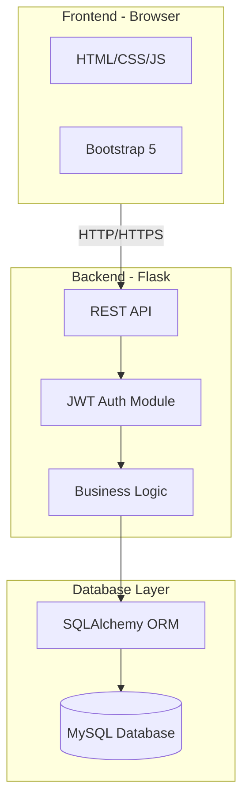
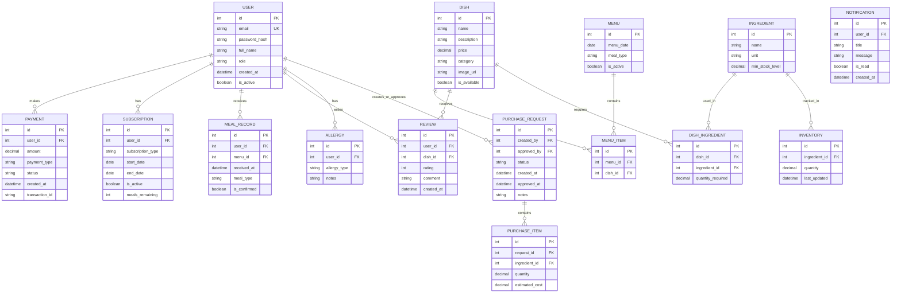
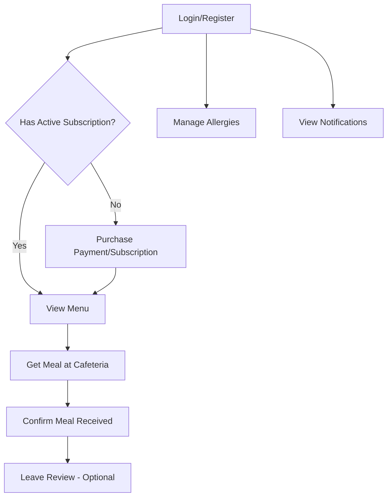
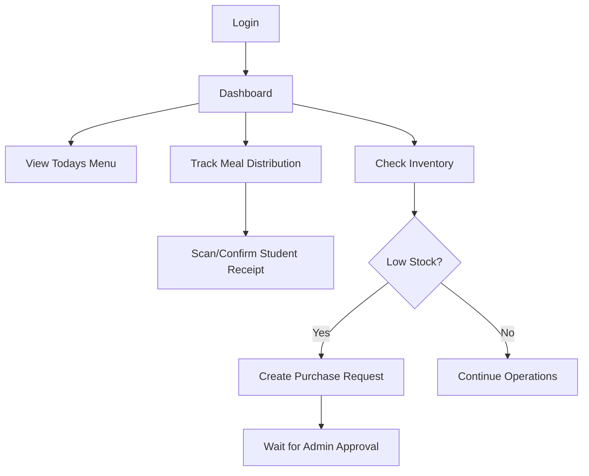
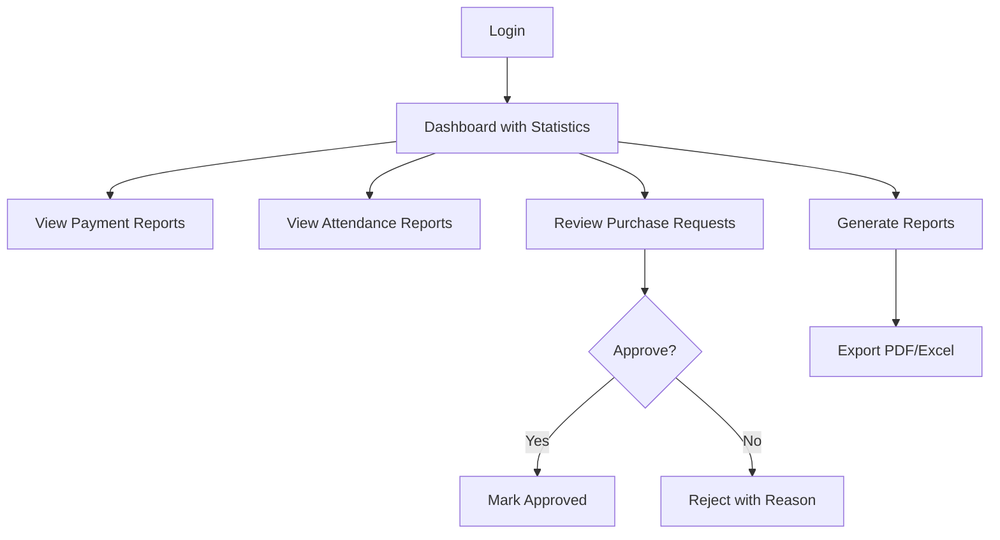

# School Cafeteria Management System - Architecture Plan

## Project Overview

A web application for managing school cafeteria operations with three user roles: Student, Cook, and Administrator. Built with Python Flask backend, Bootstrap/HTML/CSS/JS frontend, MySQL database, JWT authentication, and Docker containerization.

---

## Technology Stack

| Layer | Technology | Justification |
|-------|------------|---------------|
| **Backend** | Python 3.11+ / Flask | Lightweight, easy to learn, excellent for REST APIs |
| **Database** | MySQL 8.0 | Robust, widely-used RDBMS with good Python support |
| **ORM** | SQLAlchemy + Flask-SQLAlchemy | Pythonic database access, migration support |
| **Authentication** | JWT (PyJWT + Flask-JWT-Extended) | Stateless, secure, suitable for REST APIs |
| **Frontend** | Bootstrap 5 + HTML/CSS/JS | Responsive, quick prototyping, no build step |
| **Containerization** | Docker + Docker Compose | Easy deployment, consistent environments |
| **Migrations** | Flask-Migrate (Alembic) | Version-controlled database schema changes |

---

## System Architecture



---

## Database Schema



---

## Project Structure

```
cafeteria-proj/
├── docker-compose.yml
├── Dockerfile
├── requirements.txt
├── config.py
├── run.py
├── .env.example
├── .gitignore
├── README.md
│
├── app/
│   ├── __init__.py              # Flask app factory
│   ├── extensions.py            # Flask extensions init
│   │
│   ├── models/                  # SQLAlchemy models
│   │   ├── __init__.py
│   │   ├── user.py
│   │   ├── dish.py
│   │   ├── menu.py
│   │   ├── payment.py
│   │   ├── subscription.py
│   │   ├── inventory.py
│   │   ├── purchase_request.py
│   │   ├── review.py
│   │   └── notification.py
│   │
│   ├── api/                     # REST API blueprints
│   │   ├── __init__.py
│   │   ├── auth.py              # Login, register, JWT
│   │   ├── student.py           # Student endpoints
│   │   ├── cook.py              # Cook endpoints
│   │   ├── admin.py             # Admin endpoints
│   │   └── common.py            # Shared endpoints
│   │
│   ├── services/                # Business logic layer
│   │   ├── __init__.py
│   │   ├── auth_service.py
│   │   ├── menu_service.py
│   │   ├── payment_service.py
│   │   ├── inventory_service.py
│   │   ├── report_service.py
│   │   └── notification_service.py
│   │
│   ├── utils/                   # Utility functions
│   │   ├── __init__.py
│   │   ├── decorators.py        # Role-based access decorators
│   │   ├── validators.py
│   │   └── helpers.py
│   │
│   └── static/                  # Frontend assets
│       ├── css/
│       │   └── custom.css
│       ├── js/
│       │   ├── app.js           # Main JS with API calls
│       │   ├── auth.js
│       │   ├── student.js
│       │   ├── cook.js
│       │   └── admin.js
│       └── images/
│
├── templates/                   # Jinja2 HTML templates
│   ├── base.html
│   ├── auth/
│   │   ├── login.html
│   │   └── register.html
│   ├── student/
│   │   ├── dashboard.html
│   │   ├── menu.html
│   │   ├── payment.html
│   │   ├── allergies.html
│   │   └── reviews.html
│   ├── cook/
│   │   ├── dashboard.html
│   │   ├── meal_tracking.html
│   │   ├── inventory.html
│   │   └── purchase_requests.html
│   └── admin/
│       ├── dashboard.html
│       ├── statistics.html
│       ├── purchase_approval.html
│       └── reports.html
│
├── migrations/                  # Flask-Migrate files
│
├── tests/                       # Unit and integration tests
│   ├── __init__.py
│   ├── conftest.py
│   ├── test_auth.py
│   ├── test_student.py
│   ├── test_cook.py
│   └── test_admin.py
│
└── docs/                        # Documentation
    ├── README.md
    ├── api_documentation.md
    ├── database_schema.md
    └── diagrams/
```

---

## API Endpoints Design

### Authentication Endpoints
| Method | Endpoint | Description |
|--------|----------|-------------|
| POST | `/api/auth/register` | Register new student |
| POST | `/api/auth/login` | Login and get JWT token |
| POST | `/api/auth/logout` | Invalidate token |
| POST | `/api/auth/refresh` | Refresh JWT token |
| GET | `/api/auth/me` | Get current user info |

### Student Endpoints
| Method | Endpoint | Description |
|--------|----------|-------------|
| GET | `/api/menu` | View current menu |
| GET | `/api/menu/{date}` | View menu for specific date |
| POST | `/api/payment` | Make single payment |
| POST | `/api/subscription` | Purchase subscription |
| GET | `/api/subscription` | View active subscription |
| POST | `/api/meal/confirm` | Confirm meal received |
| GET | `/api/allergies` | Get user allergies |
| POST | `/api/allergies` | Add allergy |
| DELETE | `/api/allergies/{id}` | Remove allergy |
| GET | `/api/reviews` | Get user reviews |
| POST | `/api/reviews` | Add dish review |
| GET | `/api/notifications` | Get user notifications |

### Cook Endpoints
| Method | Endpoint | Description |
|--------|----------|-------------|
| GET | `/api/cook/meals/today` | Get todays meal distribution |
| POST | `/api/cook/meals/serve` | Mark meal as served |
| GET | `/api/cook/inventory` | View current inventory |
| PUT | `/api/cook/inventory/{id}` | Update inventory quantity |
| GET | `/api/cook/purchase-requests` | View own purchase requests |
| POST | `/api/cook/purchase-requests` | Create purchase request |

### Admin Endpoints
| Method | Endpoint | Description |
|--------|----------|-------------|
| GET | `/api/admin/statistics/payments` | Payment statistics |
| GET | `/api/admin/statistics/attendance` | Attendance statistics |
| GET | `/api/admin/purchase-requests` | View all purchase requests |
| PUT | `/api/admin/purchase-requests/{id}` | Approve/reject request |
| GET | `/api/admin/reports/meals` | Generate meal report |
| GET | `/api/admin/reports/expenses` | Generate expense report |
| GET | `/api/admin/users` | Manage users |
| POST | `/api/admin/menu` | Create/update menu |
| POST | `/api/admin/dishes` | Add new dish |

---

## User Flow Diagrams

### Student Flow


### Cook Flow


### Admin Flow


---

## Security Considerations

1. **Authentication & Authorization**
   - JWT tokens with short expiration - 15 min access, 7 day refresh
   - Role-based access control via decorators
   - Password hashing with bcrypt

2. **Input Validation**
   - All inputs validated server-side
   - SQL injection prevention via SQLAlchemy ORM
   - XSS prevention via template escaping

3. **API Security**
   - Rate limiting on authentication endpoints
   - CORS configuration for allowed origins
   - HTTPS enforcement in production

4. **Data Protection**
   - Sensitive data encrypted at rest
   - No plain-text password storage
   - Audit logging for admin actions

---

## Docker Configuration

### docker-compose.yml structure
```yaml
services:
  web:
    build: .
    ports: 5000:5000
    depends_on: db
    environment: from .env
    
  db:
    image: mysql:8.0
    volumes: persistent data
    environment: MySQL credentials
```

---

## Implementation Phases

### Phase 1: Foundation
- [ ] Project structure setup
- [ ] Docker and MySQL configuration
- [ ] Flask app factory pattern
- [ ] Database models creation
- [ ] Flask-Migrate setup

### Phase 2: Authentication
- [ ] JWT authentication implementation
- [ ] User registration endpoint
- [ ] Login/logout endpoints
- [ ] Role-based access decorators
- [ ] Password reset functionality

### Phase 3: Student Features
- [ ] Menu viewing API and UI
- [ ] Payment system - mock implementation
- [ ] Subscription management
- [ ] Meal confirmation system
- [ ] Allergy management
- [ ] Review system

### Phase 4: Cook Features
- [ ] Meal distribution tracking
- [ ] Inventory management UI
- [ ] Purchase request creation
- [ ] Daily operations dashboard

### Phase 5: Admin Features
- [ ] Statistics dashboard
- [ ] Purchase request approval workflow
- [ ] Report generation - PDF/Excel
- [ ] User management

### Phase 6: Additional Features
- [ ] Notification system
- [ ] Email notifications - optional
- [ ] Real-time updates - optional

### Phase 7: Polish and Documentation
- [ ] Frontend styling and UX improvements
- [ ] Error handling and edge cases
- [ ] Unit and integration tests
- [ ] API documentation
- [ ] README with setup instructions
- [ ] Demo video recording

---

## Test Scenarios per Requirements

Based on Section 6 - Регламент испытаний:

1. **User Registration & Login** - Test all three roles can authenticate
2. **Student Payment** - Single payment and subscription purchase
3. **Meal Confirmation** - Student marks meal as received
4. **Meal Tracking by Cook** - Cook confirms dish distribution
5. **Purchase Request** - Cook creates, admin approves/rejects
6. **Report Generation** - Admin generates meal and expense reports
7. **Exception Handling**:
   - Duplicate meal confirmation attempt
   - Insufficient inventory warning
   - Invalid payment handling
   - Expired subscription handling

---

## Deliverables Checklist

Per Section 4 - Требования к документации:

- [ ] Title page with team members
- [ ] Technology justification document
- [ ] Structural and functional diagrams
- [ ] Main algorithm flowchart
- [ ] DBMS selection justification
- [ ] Database schema documentation
- [ ] GitHub repository with README
  - [ ] Project description
  - [ ] Installation instructions
  - [ ] Video demonstration link

---

## Next Steps

1. Review and finalize this architecture plan
2. Switch to Code mode to implement Phase 1
3. Iterate through remaining phases
4. Create documentation and demo video
